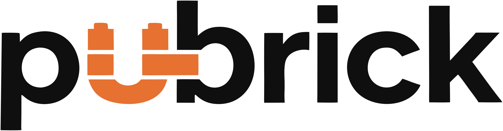

<p align="center">
  <picture>
    <source media="(prefers-color-scheme: dark)" srcset="assets/logo-dark.svg">
    
  </picture>
</p>

<p align="center"><strong>The open-source AI content factory.</strong></p>

<p align="center"><em>From your sources to published posts — with you in the loop.</em></p>

<p align="center">
  <a href="https://github.com/pubrick/pubrick/actions/workflows/ci.yml"></a>
  <a href="LICENSE"></a>
  
  
</p>

---

Pubrick watches your sources (RSS, Telegram channels), drafts on-brand posts and
articles with a team of AI agents — text and images — queues everything for
**your** approval, publishes on schedule, and learns from what performs.

**Status: pre-alpha.** Working today: accounts and sessions, organizations,
brands — each with a voice, an audience and a content language the generator is
instructed with — and channels with credentials encrypted at rest, plus content
drafts, a review queue with approval/rejection/overrides, and publishing to
Telegram, the one platform there is a publisher for — through a restyled,
installable (PWA) web app. AI generation works too, with **your own** Gemini or
OpenRouter key (there is no hosted key): type a brief and five roles —
researcher, writer, editor, a fact-checker that lists claims to verify rather
than checking them, and one adapter per channel — produce a draft with
per-channel copy and an origin badge, while Settings shows what your key has
spent. Nothing publishes that no human has opened or edited, and every model
call is recorded, including the retries and the ones that failed after the
provider had counted tokens. Not yet: publishers for the other seven platforms
(the channel form names them and refuses to connect one), a per-brand knowledge
base, refining text inside the editor, and drafting from watched sources.
Features land phase by phase — see
[docs/specs/0001-product-design.md](docs/specs/0001-product-design.md).

## Why Pubrick

- **Human-in-the-loop by design** — nothing is published without approval
  unless you explicitly enable autopilot. Anti-slop is the point.
- **Brand voice** — voice, audience and content language are set per brand and
  go into every generation's instructions, so drafts sound like you rather than
  like a model. (A per-brand knowledge base with retrieval is planned, not
  built.)
- **Bring your own keys** — Gemini and OpenRouter (hundreds of models);
  self-hosted generation at your own API cost.
- **Own it** — AGPL-3.0, docker compose, Postgres as the only stateful service.

## Quickstart (self-hosted)

Requires Docker with Compose v2.

```bash
git clone https://github.com/pubrick/pubrick && cd pubrick
cp .env.example .env

# Generate two separate secrets and paste them into .env, replacing the
# placeholder values of BETTER_AUTH_SECRET and APP_ENCRYPTION_KEY:
openssl rand -base64 32
openssl rand -base64 32

# Set POSTGRES_PASSWORD in .env too, then start:
docker compose up -d
```

Compose ships no fallback secrets: it refuses to start until those values are
real, rather than booting with a key that is public in this repository.

Web: http://localhost:3000 · API health: http://localhost:3001/api/health

`APP_ENCRYPTION_KEY` encrypts channel credentials at rest — back it up, because
losing it makes every stored credential unreadable. To rotate it, put the new
key first and keep the old one behind it (`new,old`); nothing has to be
rewritten first. Full notes, including TLS and `PUBLIC_ORIGIN`, in
[docs/self-hosting.md](docs/self-hosting.md).

## Development

Node 22 + pnpm (corepack) + Docker. `./init.sh` boots the dev stack: Postgres in
Docker, migrations, then api (:3001), worker and web (:3000) locally.

Gates: `pnpm typecheck && pnpm lint && pnpm test` — see [CONTRIBUTING.md](CONTRIBUTING.md).

## Brand assets

The wordmark, the brick mark and the social card live in [`assets/`](assets/).
Palette: ink `#0F0F0F`, brick `#E67131`, paper `#F5F6F7`.

## License

AGPL-3.0-only. See [LICENSE](LICENSE).
